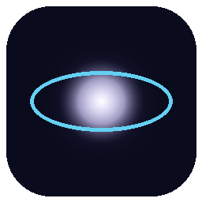
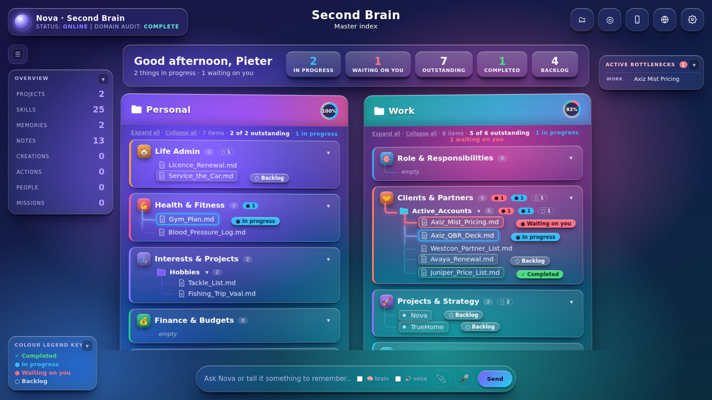
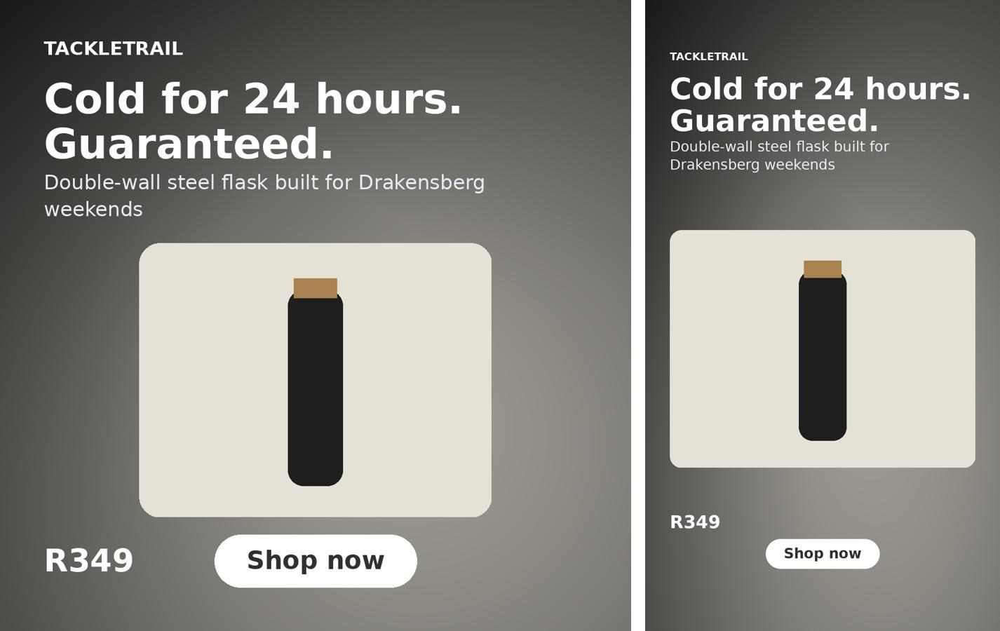
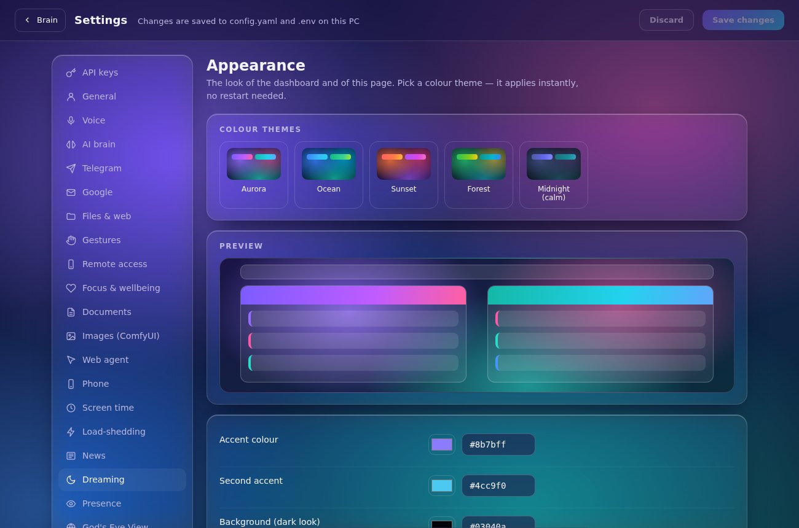
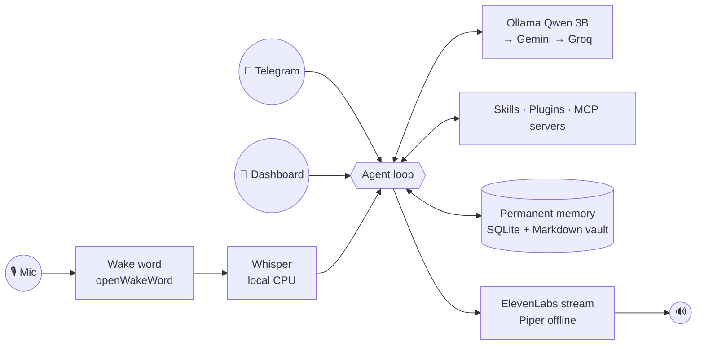

<div align="center">



# Nova

**A voice-first, local-first AI agent for your PC.**
Talk to it, and it runs your inbox, calendar, files, browser, web research, websites, videos and ads.
It remembers everything permanently and shows its whole second brain as an interactive 3D galaxy.

[Install](docs/INSTALL.md) · [Configure](docs/CONFIGURATION.md) · [Skills & plugins](docs/SKILLS.md) · [MCP](docs/MCP.md) · [All tools](docs/TOOLS.md) · [Roadmap](docs/ENHANCEMENTS.md) · [Troubleshooting](docs/TROUBLESHOOTING.md)

</div>



## Why Nova

- **Voice first.** Wake word or hotkey → local Whisper transcription → answers in a natural ElevenLabs voice,
  streamed so it starts talking almost instantly. Interrupt it any time. The natural Kokoro voice takes over offline.
- **Local first.** Everyday thinking runs on your own GPU with [Ollama](https://ollama.com). Hard tasks
  hand off to free cloud tiers (Gemini, Groq) only when needed. Your memory, notes and files stay on your PC.
- **Never forgets.** After every conversation Nova files new facts, people, projects, preferences and
  decisions into a permanent memory. Corrections are versioned, never overwritten.
- **Extensible.** Drop in Python plugins, write plain-English playbooks, or connect any
  **MCP server** (Home Assistant, GitHub, Windows desktop control, Blender…). Nova can also *be* an MCP
  server, so Claude Desktop and other AI apps can use its memory.
- **Safe by default.** Sending, deleting, moving, running commands, submitting forms and updating all ask
  "yes or no?" first. File access is limited to folders you choose.

## What it can do

| Area | Examples |
|---|---|
| 🎙 **Voice** | "Hey Jarvis, what's on tomorrow?" · follow-ups without the wake word · interrupt it mid-sentence · Ctrl+Alt+Space push-to-talk · custom "Hey Nova" |
| 📝 **Meetings** | "Record this meeting" → mic + Teams/Zoom audio → transcript, summary, decisions, your action items (to Google Tasks) |
| 🧠 **Memory & 2nd brain** | "Remember that…" · "What do you know about…?" · research saved as notes (Obsidian-compatible Markdown) |
| 🌌 **3D dashboard** | Everything sorted into project clusters (auto-linked, correctable) — or by category; every memory, note, creation and action as a star; click a topic to list and **track** items (status, pin, note), see where each came from and every step Nova took; projects & skills at a glance; live activity |
| 📱 **Remote control** | Private Telegram bot: text or voice notes in; text, voice notes and files out |
| 📧 **Google Workspace** | Gmail search/read/draft/send/reply · Calendar · Drive · Docs · Sheets · Tasks |
| 📁 **Files** | Find, read (PDF/Word/Excel), write, move, tidy folders, zip, send to phone |
| 🌐 **Web** | Search · scrape pages, links and tables · build and edit websites with live preview |
| 🖱 **Browser** | Drives its own Chrome: open, read, click, type, stay logged in, screenshot |
| 📷 **Webcam → ads** | Photo → product identified → background removed → feed/story ads + caption + ad video |
| 🎬 **Media** | Narrated videos with burned-in captions and free stock footage · photo slideshows · voice-overs · transcription · trims and conversions |
| 👁 **Vision** | "Record this meeting." … "Stop recording."           → notes + action items a few minutes later
"Look at my screen — what's this error?" · describe photos and scans · Gemini, or fully local with Gemma 3 |
| 📱 **Nova on your phone** | Private access from anywhere with Tailscale — scan the QR code on the dashboard |
| 🌙 **Nightly dreaming** | Overnight memory clean-up, 💡 connections between ideas, a daily journal and an encrypted backup |
| 🚀 **Missions** | Goals Nova works on by itself, once or on a schedule — plans, researches, writes a report to your 2nd brain and briefs you (never sends/deletes on its own) |
| 👀 **Screen watcher** | "Tell me when the render finishes / the download lands / *Export complete* appears" — local OCR, windows, programs, Downloads, vision; optional follow-up action |
| 👤 **Presence awareness** | Greets you (and briefs you) when you sit down; pauses, holds messages and can lock the PC when you walk away |
| ✋ **Gesture control** | Webcam hand gestures: ✋ stop · 👍/👎 yes/no · ✌️ listen · 👉 point = mouse · 🤏 pinch = click/drag the brain or globe (MediaPipe, local) |
| 🌐 **God's Eye View** | Live 3D globe with real planes, ships, satellites, quakes and weather — "show me Cape Town in night vision", "what planes are overhead?" ([gods-eye-view](https://github.com/bilawalsidhu/gods-eye-view), needs Node 24) |
| 🌦 **Weather** | "What's the weather?" → spoken forecast + animated weather page (free, no key) |
| ⏰ **Routines** | Reminders · scheduled briefings ("every weekday at 07:30…") |
| ⚙️ **Settings page** | API keys (masked, with Test buttons), voice, models, Telegram, skills/plugins/MCP on-off, routines, colour themes with live preview |
| 🔄 **Versions** | GitHub backup · "update yourself" · "roll back" · desktop shortcut · VS Code project |





## Requirements

| | Minimum | Recommended |
|---|---|---|
| OS | Windows 10/11 64-bit | Windows 11 |
| Python | 3.11 | 3.11 |
| RAM | 16 GB | 32 GB |
| GPU | NVIDIA 4 GB VRAM (or CPU only, slower) | NVIDIA 8 GB+ |
| Disk | 8 GB free | 20 GB (for optional image models) |
| Audio | Microphone + speakers | USB mic or headset |
| Optional | Webcam · Telegram · Google account · GitHub account | |

**Accounts and keys:** ElevenLabs (voice; the offline Piper voice works without it), free Gemini and Groq keys,
a Telegram bot token. All optional except that at least one AI model must run, and Ollama is installed for you.

## Quick start

```bat
git clone https://github.com/lesliepieter-Terblanche/Nova-Beta1.git
cd Nova-Beta1
setup.bat
```

Then fill in `.env` (it opens automatically) and double-click **Nova** on your desktop.
Full walkthrough, including Telegram, Google and GitHub: **[docs/INSTALL.md](docs/INSTALL.md)**.

## Things to say

```text
"Hey Jarvis… good morning."                          → morning briefing playbook
"Any unread emails from Acme? Read me the latest."
"Draft a reply saying I'll send the quote by Friday."   → saved as a Gmail draft
"Remember that Sam at Acme owns the network refresh deal."
"Tidy up my Downloads folder."                        → asks first
"Find the price list PDF and send it to my phone."
"Build a landing page for my property site — dark and modern."
"Take a photo of this and make an ad, price R349, and a video too."
"Open Gumtree in the browser and search for bass boats."
"Make a 60-second vertical video explaining Wi-Fi 7 to small businesses."
"Record this meeting." … "Stop recording."           → notes + action items a few minutes later
"Look at my screen — what's this error?"
"Remind me at 4 to call Sam."
"Thanks."                                             → ends the conversation
```

## How it works



More detail: [docs/ARCHITECTURE.md](docs/ARCHITECTURE.md).

## Project layout

```
main.py                 entry point (voice + Telegram + dashboard)
config.example.yaml     settings template → your config.yaml
.env.example            key template → your .env
nova/                   core: agent, LLM router, memory, voice, speech, MCP client/server, dashboard
nova/skills/            built-in abilities (system, memory, files, web, browser, google, media, camera, maintenance)
plugins/                drop-in Python abilities (example: currency)
playbooks/              plain-English procedures (morning briefing, meeting prep, research, weekly review)
docs/                   documentation
tests/                  pytest suite (runs without GPU, keys or microphone)
setup.bat · run.bat · update.bat · rollback.bat · release.bat · setup_github.bat
```

## Privacy

Your memory database, notes, browser profile, Google token and everything Nova creates live in `data/`,
`secrets/` and `workspace/` on your PC. These folders are git-ignored. Text leaves your PC only when a request
goes to a cloud model (Gemini/Groq), to ElevenLabs for speech, or to a service you asked Nova to use.
Set `llm.smart: []` to keep all reasoning local. See [SECURITY.md](SECURITY.md).

## Contributing

Ideas, playbooks, plugins and MCP recipes are welcome. See [CONTRIBUTING.md](CONTRIBUTING.md).

## License

[MIT](LICENSE). Third-party models and services have their own licences and terms. Check them before
commercial use (e.g. Piper voices, Stable Diffusion weights, ElevenLabs, Google APIs).
