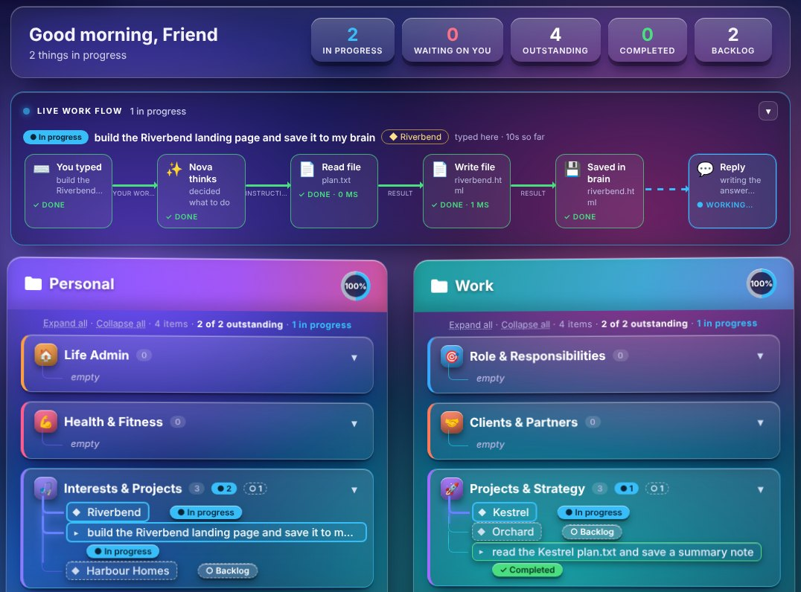
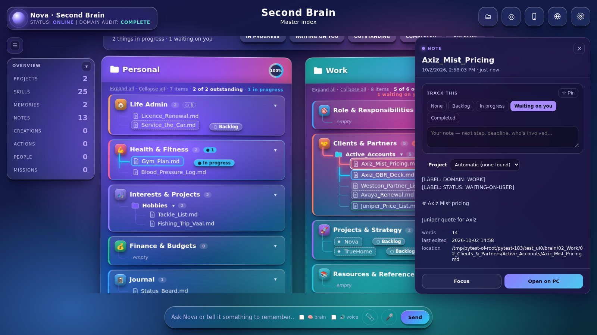
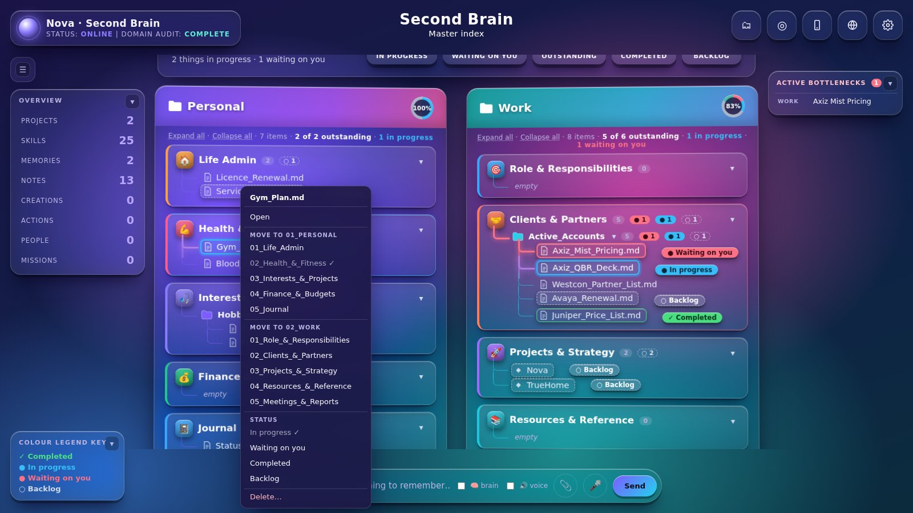
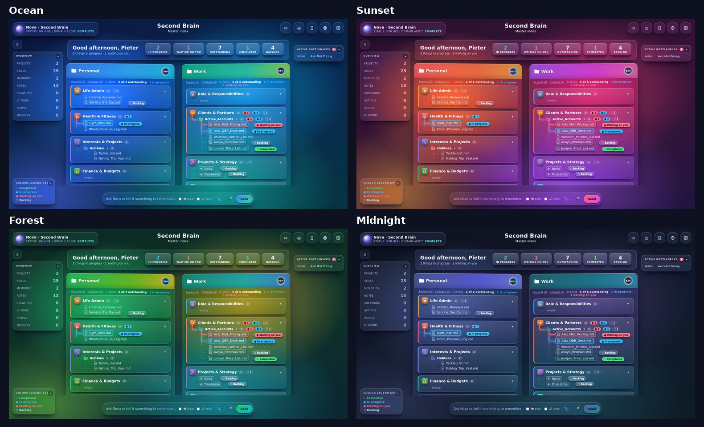
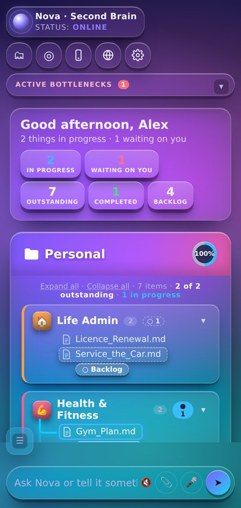
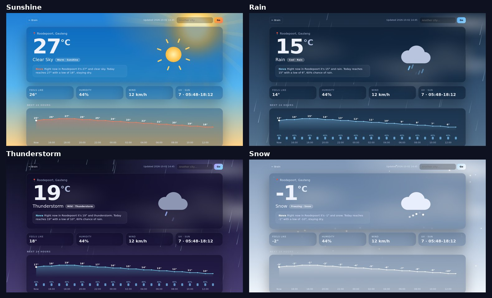
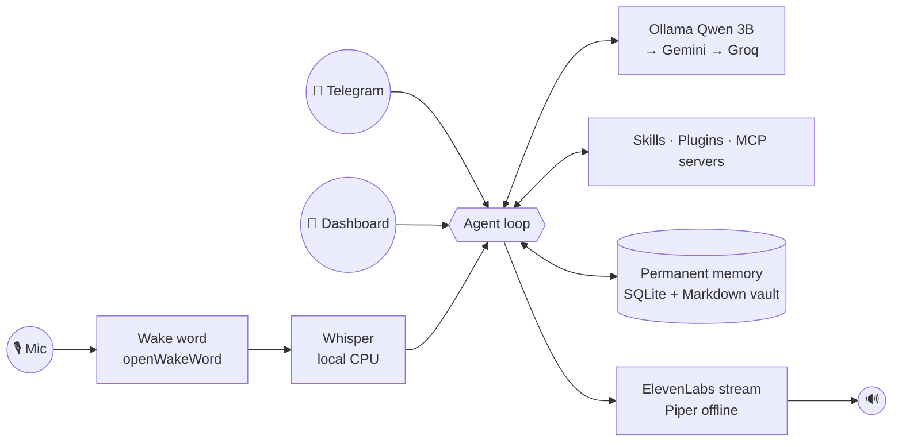

<div align="center">


# Nova

**A voice-first, local-first AI agent for your PC.**
Talk to it, and it runs your inbox, calendar, files, browser, web research, websites, videos and ads.
It remembers everything permanently and shows its whole second brain as a live master index: Personal on the left, Work on the right.

[Install](docs/INSTALL.md) · [Configure](docs/CONFIGURATION.md) · [Skills & plugins](docs/SKILLS.md) · [MCP](docs/MCP.md) · [All tools](docs/TOOLS.md) · [Roadmap](docs/ENHANCEMENTS.md) · [Troubleshooting](docs/TROUBLESHOOTING.md)

</div>



<sub>Live work flow — what is in progress right now, step by step, and Nova tagging the project and the command herself</sub>

<table>
<tr>
<td width="50%"><br><sub>Click anything to open it, set its status or link it to a project</sub></td>
<td width="50%"><br><sub>Right-click (long-press on a phone) to move, set a status or delete</sub></td>
</tr>
</table>

<details>
<summary><b>Colour themes</b> — Aurora (above), Ocean, Sunset, Forest, Midnight</summary>


</details>

<details>
<summary><b>On your phone</b> — the same index, private over Tailscale</summary>


</details>

## Why Nova

- **Voice first.** Wake word or hotkey → local Whisper transcription → answers in a natural ElevenLabs voice,
  streamed so it starts talking almost instantly. Interrupt it any time. The natural Kokoro voice takes over offline.
- **Local first.** Your memory, notes and files stay on your PC. Thinking runs on your own GPU with
  [Ollama](https://ollama.com), or — much faster on a small graphics card — on a free cloud tier (Groq, Gemini) with
  the local model as the offline fallback. You choose in Settings.
- **Never forgets.** After every conversation Nova files new facts, people, projects, preferences and
  decisions into a permanent memory. Corrections are versioned, never overwritten.
- **Extensible.** Drop in Python plugins, write plain-English playbooks, or connect any
  **MCP server** (Home Assistant, GitHub, Windows desktop control, Blender…). Nova can also *be* an MCP
  server, so Claude Desktop and other AI apps can use its memory.
- **Safe by default.** Sending, deleting, moving, running commands, submitting forms and updating all ask
  "yes or no?" first. File access is limited to folders you choose.

## What it can do

| Area | Examples |
|---|---|
| 🎙 **Voice** | "Hey Jarvis, what's on tomorrow?" · follow-ups without the wake word · interrupt it mid-sentence · Ctrl+Alt+Space push-to-talk · custom "Hey Nova" |
| 📝 **Meetings** | "Record this meeting" → mic + Teams/Zoom audio → transcript, summary, decisions, your action items (to Google Tasks) |
| 🧠 **Memory & 2nd brain** | "Remember that…" · "What do you know about…?" · research saved as notes (Obsidian-compatible Markdown) |
| 🗂 **Brain filing rules** | Everything under `01_Personal/` or `02_Work/`, numbered categories, three levels, clean names · every note labelled `[LABEL: DOMAIN: …]` `[LABEL: STATUS: …]` · status boards of what waits on you · reorganises your existing notes only after you approve (backup first, links kept) |
| 🗃 **Master Index dashboard** | Your brain as a live folder tree: `01_Personal` \| `02_Work` → numbered categories → files · blue = in progress, red = waiting on you, green = completed — Nova tags commands and projects herself as she works · **live work flow**: what is in progress, step by step, with the data moving between the steps · active bottlenecks list · light on memory (plain HTML, no 3D) · click anything to open, track or correct it |
| 📱 **Remote control** | Private Telegram bot: text or voice notes in; text, voice notes and files out |
| 📧 **Google Workspace** | Gmail search/read/draft/send/reply · Calendar · Drive · Docs · Sheets · Tasks |
| 📁 **Files** | Find, read (PDF/Word/Excel), write, move, tidy folders, zip, send to phone |
| 🌐 **Web** | Search · scrape pages, links and tables · build and edit websites with live preview |
| 🖱 **Browser** | Drives its own Chrome: open, read, click, type, stay logged in, screenshot |
| 📷 **Webcam → ads** | Photo → product identified → background removed → feed/story ads + caption + ad video |
| 🎬 **Media** | Narrated videos with burned-in captions and free stock footage · photo slideshows · voice-overs · transcription · trims and conversions |
| 📱 **Phone hands** | Operates your Android phone over Tailscale — apps, taps, typing, screenshots, photos, files; reads, replies to and schedules messages (WhatsApp, SMS, Telegram, email…); announces messages and calls, answers / declines by voice, calls contacts by name; the phone's live screen in a window on the PC; quick switches, routines that can start by themselves, navigation, one-time codes, media; ring / locate my phone; a health card on the dashboard; reconnects by herself; stops before paying/deleting |
| 💳 **Budget & slips** | Photograph a slip or invoice — Nova reads it, files it under Personal and tracks the month against your budgets; claims are followed until they are paid and exported as a pack |
| ↩ **Undo & learning** | "Undo that" puts back her last change; she learns from your corrections (filing, shop categories, how you like things done) |
| 🗓 **Weekly report & review** | A Friday work report (moved / stuck / next week) and a Sunday review of what Nova did for you, what failed and what you never use |
| 🪟 **Answers on screen** | Weather, PC stats (live circle gauges), screen time, news, load-shedding and more pop up in a 3D, see-through window in your theme colours — on the PC and the phone |
| ✂️ **Shorts maker** | Long video → captioned vertical Shorts / Reels / TikToks (AI picks the best moments) · add captions · make vertical · join clips (moviepy) |
| 🎨 **ComfyUI images** | Free image generation on your own graphics card — posts, ads, thumbnails in any format, or your own ComfyUI workflow |
| 🌐 **AI web agent** | "Register the deal on the Juniper portal" — works websites in its own Chrome window (browser-use), stops before pay/send/submit |
| 🧭 **Screen time** | "Where did my day go?" from ActivityWatch, a *Where today went* card on the Focus screen and kind drift nudges in work hours |
| 📄 **Reads everything** | Word, PowerPoint, Excel, PDF, Outlook .msg, EPUB (markitdown) · optional docling for PDF tables → Excel |
| 👁 **Vision** | "Record this meeting." … "Stop recording."           → notes + action items a few minutes later
"Look at my screen — what's this error?" · describe photos and scans · Gemini, or fully local with Gemma 3 |
| 📱 **Nova on your phone** | Private access from anywhere with Tailscale — scan the QR code on the dashboard |
| 🌙 **Nightly dreaming** | Overnight memory clean-up, 💡 connections between ideas, a daily journal and an encrypted backup |
| 🚀 **Missions** | Goals Nova works on by itself, once or on a schedule — plans, researches, writes a report to your 2nd brain and briefs you (never sends/deletes on its own) |
| 👀 **Screen watcher** | "Tell me when the render finishes / the download lands / *Export complete* appears" — local OCR, windows, programs, Downloads, vision; optional follow-up action |
| 👤 **Presence awareness** | Greets you (and briefs you) when you sit down; pauses, holds messages and can lock the PC when you walk away |
| ✋ **Gesture control** | Webcam hand control: move your hand = cursor (with labels for files, folders, links) · ✊ close = click / drag · 👈 swipe = back · 👉 swipe = dashboard · push/pull = zoom · 👍 Enter · 👎 Delete · ✌️ listen/scroll (MediaPipe, local) |
| 🖐 **PC hands** | Opens apps, webcam and folders, manages windows, clicks and types in any app — "do it for me" step by step, stops before sending/paying/deleting, Esc to take over |
| ◎ **Focus & wellbeing** | Made for ADHD and bipolar II: one thing at a time, "I'm stuck" first steps, brain dump, calm visuals, routine anchors, night guardrails, private encrypted check-ins and a summary for your doctor |
| 📥 **Forward to file** | Forward links, PDFs, photos, business cards or voice notes to the Telegram bot — summarised and filed in your brain |
| 🎬 **Cinematic mode** | Film-look reels from your photos and clips, free on this PC: 3D camera moves on photos, colour grades, brand intro/outro, highlighted captions, cuts on the beat; small photos sharpened with Real-ESRGAN |
| 📚 **Skills library** | The open-source skills from [anthropics/skills](https://github.com/anthropics/skills) as playbooks: web design, internal comms, themes, posters, MCP servers |
| ♻ **More free AI** | Gemini, Groq, Cerebras, Mistral and GitHub Models in a chain — when one hits its free limit Nova rests it and the next answers |
| 🌱 **Gets better by herself** | A weekly self-review of what she struggled with and would change, and playbooks she drafts for jobs you keep asking for — used only after your yes |
| 👤 **People cards** | Everyone you deal with on one card — company, role, contact details, deals and every mention, linked on the dashboard |
| 🧠 **Ask the brain** | Answers only from your own brain, with clickable sources · weekly "what's new" digest · 🕘 timeline replay |
| ⚡ **Load-shedding** | Your area's schedule and a heads-up 30 min before the power goes off (EskomSePush, free token) |
| 💸 **Price watcher** | "Tell me when this drops below R8,000" — Takealot and most shops, checked every few hours |
| 📰 **News** | SA headlines and news about your vendors (Juniper, Avaya, Nokia…) — "vendor news" |
| 🌦 **Weather** | "What's the weather?" → spoken forecast + a weather page that looks like the day: sunshine, rain, storm, snow, frost, heat (free, no key) |
| ⏰ **Routines** | Reminders · scheduled briefings ("every weekday at 07:30…") |
| ⚙️ **Settings page** | API keys (masked, with Test buttons), voice, models, Telegram, skills/plugins/MCP on-off, routines, colour themes with live preview |
| 🔄 **Versions** | GitHub backup · "update yourself" · "roll back" · desktop shortcut · VS Code project |




## Requirements

| | Minimum | Recommended |
|---|---|---|
| OS | Windows 10/11 64-bit | Windows 11 |
| Python | 3.11 | 3.11 |
| RAM | 16 GB | 32 GB |
| GPU | NVIDIA 4 GB VRAM (or CPU only, slower) | NVIDIA 8 GB+ |
| Disk | 8 GB free | 20 GB (for optional image models) |
| Audio | Microphone + speakers | USB mic or headset |
| Optional | Webcam · Telegram · Google account · GitHub account | |

**Accounts and keys:** ElevenLabs (voice; the offline Piper voice works without it), free Gemini and Groq keys,
a Telegram bot token. All optional except that at least one AI model must run, and Ollama is installed for you.

## Quick start

```bat
git clone https://github.com/lesliepieter-Terblanche/Nova-Beta1.git
cd Nova-Beta1
setup.bat
```

Then fill in `.env` (it opens automatically) and double-click **Nova** on your desktop.
Full walkthrough, including Telegram, Google and GitHub: **[docs/INSTALL.md](docs/INSTALL.md)**.

## Things to say

```text
"Hey Jarvis… good morning."                          → morning briefing playbook
"Any unread emails from Acme? Read me the latest."
"Draft a reply saying I'll send the quote by Friday."   → saved as a Gmail draft
"Remember that Sam at Acme owns the network refresh deal."
"Tidy up my Downloads folder."                        → just does it (deleting & sending still ask)
"Find the price list PDF and send it to my phone."
"Build a landing page for my property site — dark and modern."
"Take a photo of this and make an ad, price R349, and a video too."
"Open Gumtree in the browser and search for bass boats."
"Make a 60-second vertical video explaining Wi-Fi 7 to small businesses."
"Record this meeting." … "Stop recording."           → notes + action items a few minutes later
"Look at my screen — what's this error?"
"What do I know about the Northwind Mist deal?"          → answer from your brain, with sources
"Who is Sam? What's his number?"                      → people card
"Save this to my brain: <link>"                       → or just forward it to the Telegram bot
"What stage of load-shedding are we on?"
"Tell me when this drops below R8,000: <takealot link>"
"Any news about Juniper this week?"
"Summarise this YouTube video: <link>"                → YouTube MCP server (Settings → Extensions → Add)
"Remind me at 4 to call Sam."
"Thanks."                                             → ends the conversation
```

## How it works



More detail: [docs/ARCHITECTURE.md](docs/ARCHITECTURE.md).

## Project layout

```
main.py                 entry point (voice + Telegram + dashboard)
config.example.yaml     settings template → your config.yaml
.env.example            key template → your .env
nova/                   core: agent, LLM router, memory, voice, speech, MCP client/server, dashboard
nova/skills/            built-in abilities (system, memory, files, web, browser, google, media, camera, maintenance)
plugins/                drop-in Python abilities (example: currency)
playbooks/              plain-English procedures (morning briefing, meeting prep, research, weekly review)
docs/                   documentation
tests/                  pytest suite (runs without GPU, keys or microphone)
setup.bat · run.bat · update.bat · rollback.bat · release.bat · setup_github.bat
```

## Privacy

Your memory database, notes, browser profile, Google token and everything Nova creates live in `data/`,
`secrets/` and `workspace/` on your PC. These folders are git-ignored. Text leaves your PC only when a request
goes to a cloud model (Gemini/Groq), to ElevenLabs for speech, or to a service you asked Nova to use.
Set `llm.smart: []` to keep all reasoning local. See [SECURITY.md](SECURITY.md).

## Contributing

Ideas, playbooks, plugins and MCP recipes are welcome. See [CONTRIBUTING.md](CONTRIBUTING.md).

## License

[MIT](LICENSE). Third-party models and services have their own licences and terms. Check them before
commercial use (e.g. Piper voices, Stable Diffusion weights, ElevenLabs, Google APIs).
