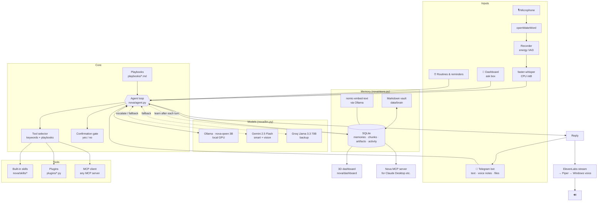

# Architecture

## A request, step by step

1. **Input:** wake word → record until silence → Whisper text. Or a Telegram message, dashboard question or routine.
2. **Context:** the system prompt gets the time, your name and city, your **core memories** (most important
   and most used), memories and note snippets **relevant to this request**, and any matching **playbooks**.
3. **Tool selection:** only relevant tool groups are offered to the model (see [SKILLS.md](SKILLS.md#how-nova-chooses-tools)).
4. **Model:** Ollama first. The request goes to Gemini/Groq if it matches `escalate_keywords`, if the local model
   errors or returns nothing, or after 3 tool rounds. Malformed JSON tool calls from small models are salvaged.
5. **Tools:** executed one by one. A tool marked `confirm` pauses the turn and asks you. The next message
   ("yes"/"no") resumes it with the full context kept.
6. **Reply:** spoken (long answers are trimmed and the full text goes to Telegram) and/or sent. Files the tools
   produced are attached.
7. **Learning (background):** the exchange is sent to the model with the related memories. New durable facts
   are added, duplicates are reinforced, and corrections supersede old memories (never deleted). `_Nova Memory.md`
   is refreshed.
8. **Logging:** every request, tool call, reply, memory and creation is written to `activity`. The dashboard
   polls it every 1.5 s.

## Memory model

| Table | Holds | Notes |
|---|---|---|
| `memories` | kind (fact, preference, person, project, decision, goal, routine, event), text, importance 1–3, uses, `superseded_by` | Corrections create a new row and link the old one, so there's a full history |
| `chunks` | Paragraph-chunks of every note in the vault + embeddings | Re-indexed when files change (also at start-up) |
| `artifacts` | Everything Nova made or touched: files, sites, videos, ads, emails, docs, events | Powers the dashboard and "open on PC" |
| `activity` | Timeline of requests, tool calls, replies, memories, reminders | Live feed |

Embeddings come from `nomic-embed-text` in Ollama. If Ollama is down, search falls back to keyword overlap and
retries embeddings after 2 minutes. SQLite runs in WAL mode so the MCP server can read while Nova writes.

## Threads

| Thread | Job |
|---|---|
| main | Telegram polling (or the voice loop if Telegram is off) |
| voice | Wake word, recording, speaking |
| dashboard | HTTP server on 127.0.0.1 |
| mcp | asyncio loop holding MCP sessions open |
| browser | Playwright (its objects must stay on one thread) |
| reminders, routines | Schedulers (30 s / 15 s ticks) |
| learning | Short-lived, one per conversation turn |

The agent is serialised with a lock (one GPU, one conversation at a time). Each channel (`voice`, `tg:<id>`,
`dashboard`, `routine:<name>`) has its own short-term history. Long-term memory is shared by all of them.

## Security model

- Local services (dashboard, Ollama) bind to localhost. The dashboard rejects cross-origin POSTs.
- Telegram only answers allow-listed user IDs.
- File tools are sandboxed to `files.allowed_roots`. Deletes go to the Recycle Bin, and overwrites keep `.bak`.
- Risky tools need explicit confirmation in the same channel. MCP tools use annotation-aware `confirm: auto`.
- Secrets live in `.env` and `secrets/`, never in `config.yaml` or Git.
- The Nova MCP server never exposes confirmation-gated tools.
